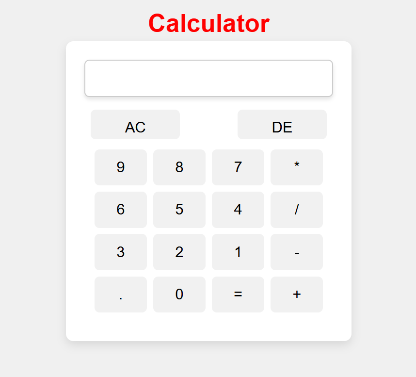

# Calculator-JS
calculator made using js that also follows the operator precedence 
also added responsiveness to the site 
### can check this out on the [link](https://niraj-ramnani.github.io/Calculator-JS/)

